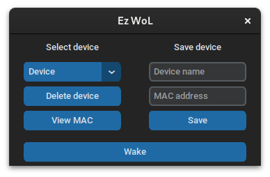

# Easy Wake On Lan  
EzWoL is a simple user-friendly device manager for remote turning on devices via wake on lan.  
  
## Installation
`git clone https://github.com/kolbanidze/ezwol`

`cd ezwol`

`pip install customtkinter`

## Usage
`python3 main.py`

## Screenshot  

## How to use it  

Open **main.py**.  
To save device for future waking, enter device name, MAC and click "**save**".  
To wake device you need to select device and click "**Wake**".  
To delete device, click "**Delete device**".  
To view saved MAC address, click "**View MAC**".  
If program couldn't detect broadcast ip and can't wake pc, then enter required ip into **CUSTOM_BROADCAST_IP** (I couldn't reproduce such problem, so that why there isn't ui for it).

## How it works  
When you activate Wake On Lan in your bios settings and when 
your computer is off, your network card starts 
listening for special magic packet. 
If your MAC is 01:23:45:67:89:1A Magic packet has the following scheme (HEX):
FF FF FF FF FF FF **01 23 45 67 89 1A** (16 times).  
**FF FF FF FF FF FF** - header.

Packet (HEX)

FF FF FF FF FF FF 01 23 45 67 89 1A 01 23 45 67 89 1A 01 23 45 67 89 1A 01 23 45 67 89 1A 01 23 45 67 89 1A 01 23 45 67 89 1A 01 23 45 67 89 1A 01 23 45 67 89 1A 01 23 45 67 89 1A 01 23 45 67 89 1A 01 23 45 67 89 1A 01 23 45 67 89 1A 01 23 45 67 89 1A 01 23 45 67 89 1A 01 23 45 67 89 1A 01 23 45 67 89 1A

That magic packet sends as UDP broadcast message (to 255.255.255.255) to port 7/9.
EzWoL uses 9 port, because of discard protocol.